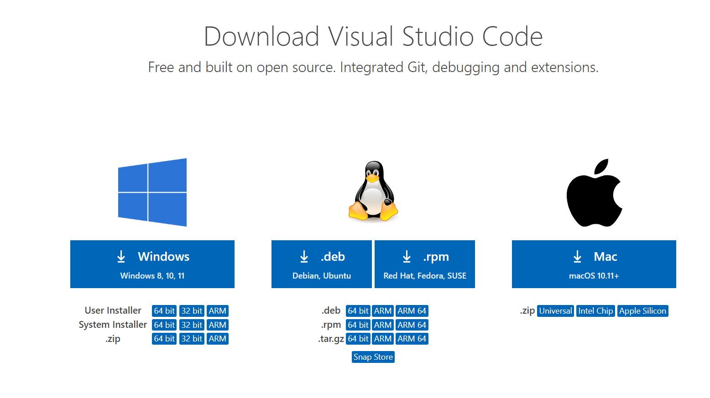
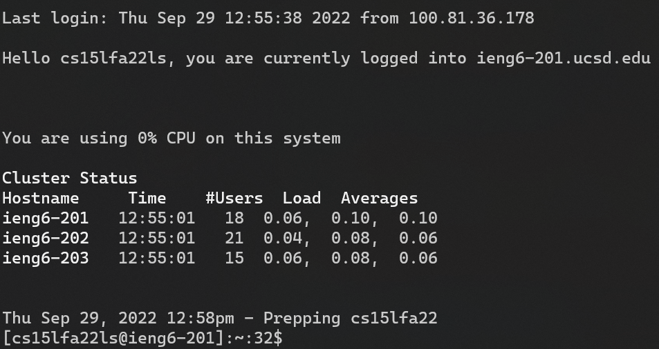
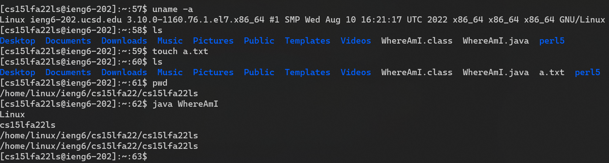
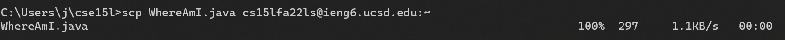
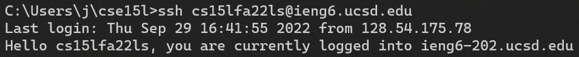
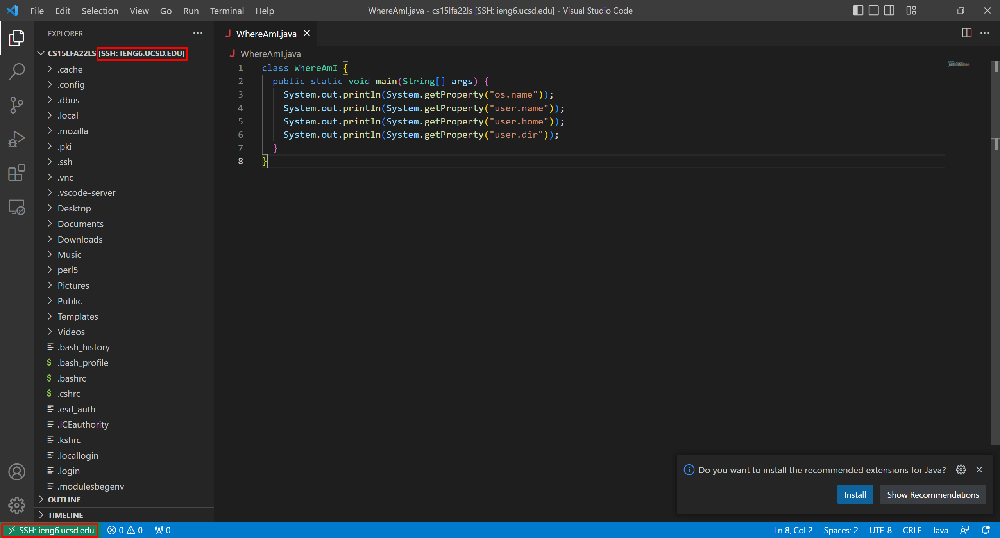

## How to connect to ieng6 (& more)

#### Prerequisites

- You should already have an assigned ieng6 account
- You should already have set your ieng6 account password
- You should have a computer running macOS, Linux, or Windows, with `openssh` installed.

### Step 1: Install VS Code

Go to [code.visualstudio.com/download](https://code.visualstudio.com/download) to download the appropriate version of Visual Studio Code for your computer.

VS code will be extremely useful for editing files, running commands, and accessing remote systems all in one place.

### Step 2: Remotely connect

Open the terminal on your computer. On most Linux systems, you can open it using Control + Alt + T. On macOS, it's an app called Terminal. On Windows 10, open the Command Prompt app (`cmd.exe`). on Windows 11, open the Terminal app (`wt.exe`).

Type the following SSH command to remotely connect into ieng6 (replacing `your-account` with your username):

`ssh your-account@ieng6.ucsd.edu`

You should get a prompt for a password and, after entering it, should see something like this:

### Step 3: Try some commands

Try a few commands to test out your remote connection! All commands run on the *remote* machine rather than the *local* machine. This means that all programs, paths, files, users, etc. are the server's.

### Step 4: Move your files with SCP

When working on remote computers, you'll probably want to bring over some files from your local computer.

With SCP, you can easily copy local files to a directory on a remote machine in a similar way to SSH.

To copy a file called WhereAmI.java to your remote home directory (`~`), the command used would be:

`scp WhereAmI.java your-account@ieng6.ucsd.edu:~`

Here's what that looks like in the terminal:
 

### Step 5: Setup an SSH key

Since typing in a password every time is annoying, we can use SSH keys to authenticate instead.

SSH keys allow you to authenticate with a file generated on your computer instead of with a password.

To create an SSH key, run the following command, pressing enter, leaving all prompts blank/default:

`ssh-keygen`

This will generate a keypair in your `~/.ssh` folder. To make the server trust your key, copy public part of the key (the one ending in `.pub`) to `~/.ssh/authorized_keys` on the server.

Now the server trusts your generated SSH key, allowing you to login without a password!

### Step 6: Optimize your workflow

There's two main ways to simplify this workflow:

1) Using VS Code's "Remoting" feature to edit, save, and run files on the remote machine via a GUI. (this is faster)

2) Creating scripts to run all of the needed commands without typing each of them in each time. (this is more configurable)

#### Working with remote files in VS Code

In VS Code, click the green icon in the bottom-left corner, then under Remote SSH, select "Connect to host".

Type the connection in SSH format (`your-account@ieng6.ucsd.edu`) and then type your password.

Now, you can use VS Code to edit and run remote files in exactly the same way that you would for local files!

Notice the indicators of a remote connection in the red boxes below:

#### Automate tasks with scripts

Another way to automate tasks such as this is with scripts. Using scripts is much more reliable than using command history or copy & paste because all of the commands live in a file, making it much easier to run set of commands consistently and without mistakes.

In Windows, this can be accomplished simply by putting all of the commands in a text file ending in `.bat` in your working directory, then typing the name of the `.bat` file to run it (e.g. if the file was named `u.bat`, running the `u` command would run the script). Note that this only works in Command Prompt, not PowerShell, which uses a separate and much more complicated scripting system.

##### Congratulations! You've successfully connected to `ieng6` and setup highly configurable and efficient workflows for remote access! 🎉