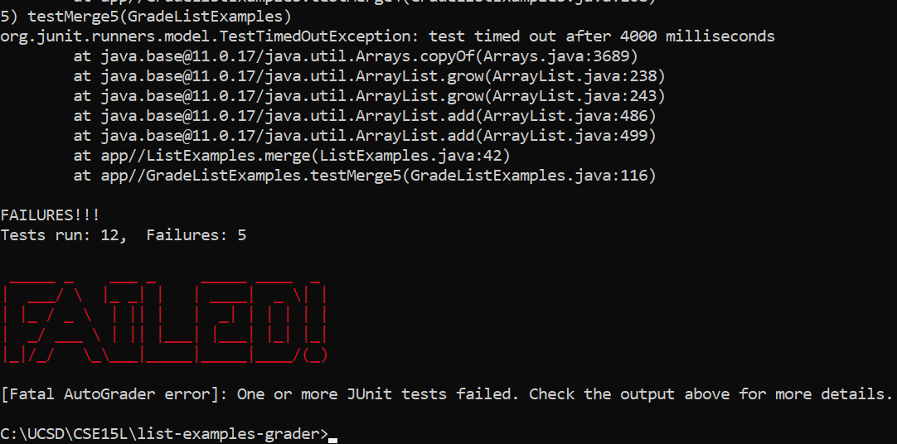
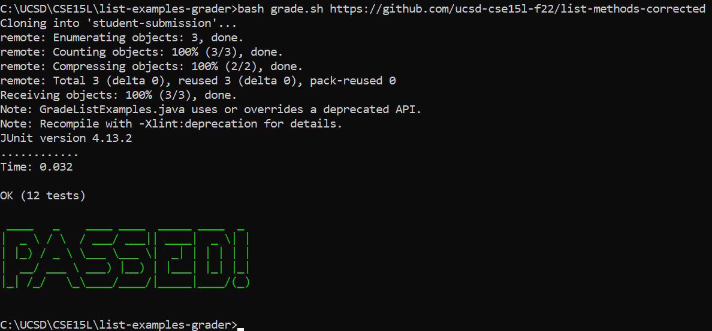
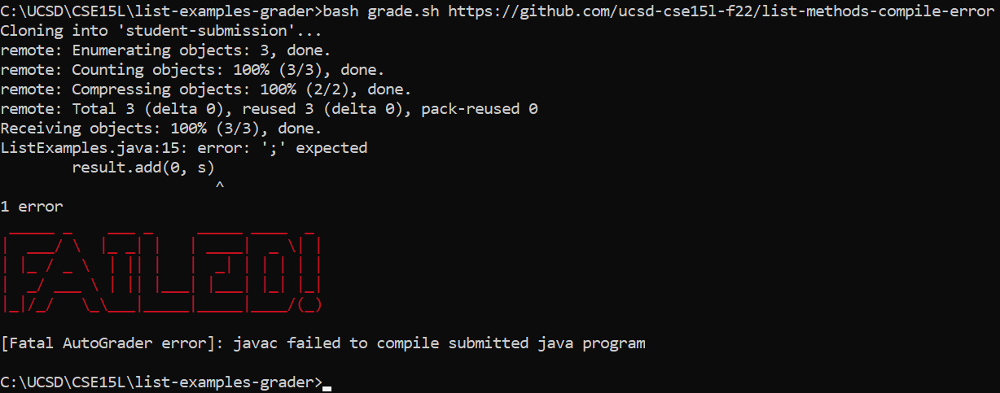

## Lab Report 5

### `grade.sh` file:

```bash
# List ../lib/* first to prevent students from overriding JUnit
CLASSPATH="../lib/*:."

# Bash colors
RED="\e[31m"
GREEN="\e[92m"
STOP="\e[0m"

# Fail function
fail() {
    printf "${RED}"
    figlet FAILED!
    printf "${STOP}"
    >&2 echo [Fatal AutoGrader error]: $1
    exit 1
}

rm -rf student-submission

git clone $1 student-submission
if [[ $? -ne 0 ]]; then fail "Failed to clone git repository"; fi

# copy tests into submission
cp GradeListExamples.java student-submission/

cd student-submission

if [[ ! -e ListExamples.java ]]; then fail "Expected file ListExamples.java does not exist"; fi

javac -cp $CLASSPATH *.java
if [[ $? -ne 0 ]]; then fail "javac failed to compile submitted java program"; fi

java -cp $CLASSPATH org.junit.runner.JUnitCore GradeListExamples
if [[ $? -ne 0 ]]; then fail "One or more JUnit tests failed. Check the output above for more details."; fi

printf "${GREEN}"
figlet PASSED!
printf "${STOP}"
```

### Samples

#### Sample 1: https://github.com/ucsd-cse15l-f22/list-methods-lab3



#### Sample 2: https://github.com/ucsd-cse15l-f22/list-methods-corrected


#### Sample 3: https://github.com/ucsd-cse15l-f22/list-methods-compile-error


### Tracing `grade.sh`: Sample 3 (https://github.com/ucsd-cse15l-f22/list-methods-compile-error)

- Line 2: ```CLASSPATH="../lib/*:."``` - This line stores the classpath used for `javac` and `java` in later lines

**Exit code**: 0

- Line 5: `RED="\e[31m"` - This line stores the ANSI color code for displaying red text in terminal output

**Exit code**: 0

- Line 6: `GREEN="\e[92m"` - This line stores the ANSI color code for displaying green text in terminal output

**Exit code**: 0

- Line 7: `STOP="\e[0m"` - This line stores the ANSI color reset code for restoring terminal output to the default color

**Exit code**: 0

- Line 10: `fail() {` - This line starts the function definition for the block of commands that run when a failure occurs. Lines 11-15 are in the body of this function.

**Exit code**: 0

- Line 11: `printf "${RED}"` - This line uses the ANSI color code stored in the `RED` variable to set the terminal output to display red text

**stdout**: ``

**Exit code**: 0

- Line 12: `figlet FAILED!` - This line uses `figlet` to print "FAILED" to the terminal using a large ASCII-art font

**stdout**:
```
 _____ _    ___ _     _____ ____  _ 
|  ___/ \  |_ _| |   | ____|  _ \| |
| |_ / _ \  | || |   |  _| | | | | |
|  _/ ___ \ | || |___| |___| |_| |_|
|_|/_/   \_\___|_____|_____|____/(_)
                                    
```

**Exit code**: 0

- Line 13: `printf "${STOP}"` - This line uses the ANSI color code stored in `STOP` to return terminal output to its default color

**stdout**: ``

**Exit code**: 0

- Line 14: `>&2 echo [Fatal AutoGrader error]: $1` - This line uses the `echo` command to print the autograder error, passed as the first argument to the `fail` function, to `stderr`

**stderr**: `[Fatal AutoGrader error]: javac failed to compile submitted java program`

**Exit code**: 0

- Line 15: `exit 1` - This line exists the script with code `1`, indicating to the shell that an error ocurred. This is the last line in the `fail` function.

**Exit code**: 1

- Line 18: `rm -rf student-submission` - This line recursively and forcefully deletes the `student-submission` folder if it exists to create a clean state for grading the student's submission.

**Exit code**: 0

- Line 20: `git clone $1 student-submission` - This line uses `git clone` to clone the student's repository into a new folder called `student-submission`.

**stderr**: `Cloning into 'student-submission'...`

**Exit code**: 0

- Line 21: `if [[ $? -ne 0 ]]; then fail "Failed to clone git repository"; fi` - This line checks if `git clone` failed to clone the student's git repository. If a failure occurred, it runs the `fail` function with a relevant error message.

*The code in the `if` statement did not run as `git clone` did not fail*

- Line 24: `cp GradeListExamples.java student-submission/` - This line copies the `GradeListExamples.java` file, containing unit tests for the autograder, into the student's submission folder.

**Exit code**: 0

- Line 26: `cd student-submission` - This line changes the working directory to the student's submission folder.

**Exit code**: 0

- Line 28: `if [[ ! -e ListExamples.java ]]; then fail "Expected file ListExamples.java does not exist"; fi` - This line checks if the file `ListExamples.java` is missing. If it is, it runs the `fail` function with a relevant error message.

*The code in the `if` statement did not run as `ListExamples.java` exists in the sample repository*

- Line 30: `javac -cp $CLASSPATH *.java` - This line compiles the java program in the student's submission, along with the autograder script copied earlier.

**stderr**:
```
ListExamples.java:15: error: ';' expected
        result.add(0, s)
                        ^
1 error
```

**Exit code**: 1

- Line 31: `if [[ $? -ne 0 ]]; then fail "javac failed to compile submitted java program"; fi` - This line checks if `javac` failed to compile the code in the submission. If a failure occurred, it runs the `fail` function with a relevant error message.

In this case, the condition is met since the error code from `javac` above was 1 (non-zero). The outcome of the code in the `if` statement (the `fail` function) is:

**stdout**:
```
 _____ _    ___ _     _____ ____  _ 
|  ___/ \  |_ _| |   | ____|  _ \| |
| |_ / _ \  | || |   |  _| | | | | |
|  _/ ___ \ | || |___| |___| |_| |_|
|_|/_/   \_\___|_____|_____|____/(_)
                                    

```

**stderr**: `[Fatal AutoGrader error]: javac failed to compile submitted java program`

**Exit code**: 1

- Line 33: `java -cp $CLASSPATH org.junit.runner.JUnitCore GradeListExamples` - This line runs the autograder's unit tests via JUnit.

*This line did not run as the script was exited prematurely in via the `fail` function*

- Line 34: `if [[ $? -ne 0 ]]; then fail "One or more JUnit tests failed. Check the output above for more details."; fi` - This line checks if any of the JUnit tests failed. If any of them did, it runs the `fail` function with a relevant error message.

*This line did not run as the script was exited prematurely in via the `fail` function*

- Line 36: `printf "${GREEN}"` - This line uses the ANSI color code stored in the `GREEN` variable to set the terminal output to display green text 

*This line did not run as the script was exited prematurely in via the `fail` function*

- Line 37: `figlet PASSED!` - This line uses `figlet` to print "PASSED!" to the terminal using a large ASCII-art font

*This line did not run as the script was exited prematurely in via the `fail` function*

- Line 38: `printf "${STOP}"` - This line stores the ANSI color reset code for restoring terminal output to the default color

*This line did not run as the script was exited prematurely in via the `fail` function*