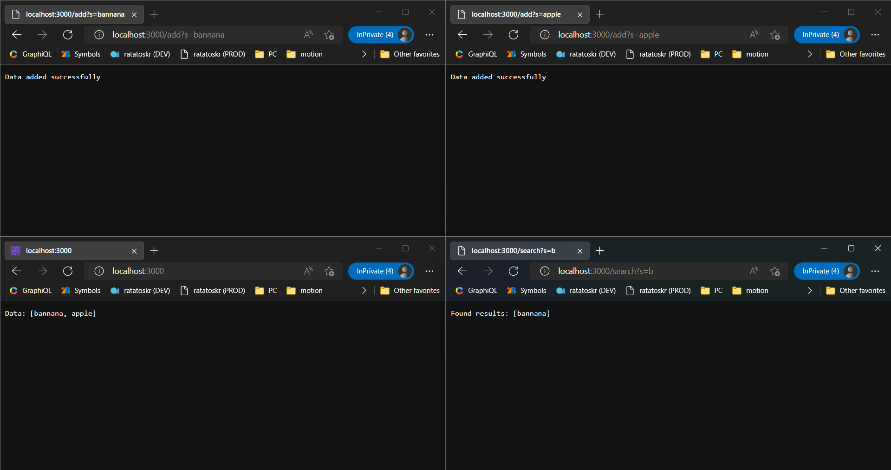

## Week 3 Lab Report

### Part 1: Explaining `SearchEngine.java`
`SearchEngine.java`:
```java
import java.io.IOException;
import java.net.URI;
import java.util.ArrayList;

class Handler implements URLHandler {
    //Tracks all data added to the searchable results
    ArrayList<String> searchableData = new ArrayList<String>();

    private String getQueryParameter(URI url, String key) {
        //Get the URL query
        String query = url.getQuery();
        if (query == null) return null;

        //Check each key-value pair
        String[] kvPairs = query.split("&");
        for (String kvPair : kvPairs) {
            String[] splitPair = kvPair.split("=");

            //Split pair into its components
            String pairKey = splitPair[0];
            String pairValue = splitPair[1];

            //Return the value for the matching key
            if (pairKey.equals(key)) return pairValue;
        }

        //Can return null if the key wasn't found (or no query component)
        return null;
    }

    public String handleRequest(URI url) {
        switch (url.getPath()) {
            case "/": {
                return "Data: " + searchableData;
            }
            case "/add": {
                //Get the s parameter
                String s = getQueryParameter(url, "s");
                if (s == null) return "400 Bad Request";

                //Add the data to the list of searchable items
                searchableData.add(s);

                return "Data added successfully";
            }
            case "/search": {
                //Get the s parameter
                String s = getQueryParameter(url, "s");
                if (s == null) return "400 Bad Request";

                //Search for results
                ArrayList<String> results = new ArrayList<String>();
                for (String data : searchableData) {
                    if (data.contains(s)) results.add(data);
                }

                //Return results
                return "Found results: " + results;
            }
            default: {
                return "404 Not Found";
            }
        }
    }
}

class SearchEngine {
    public static void main(String[] args) throws IOException {
        if(args.length == 0){
            System.out.println("Missing port number! Try any number between 1024 to 49151");
            return;
        }

        int port = Integer.parseInt(args[0]);

        Server.start(port, new Handler());
    }
}
```

Screenshots:



#### Common notes:

All of the screenshots run code defined in the `Handler` class. Its `handleRequest` contains a switch that handles the request by running the relevant code.

For handlers that need URL query parameter data, the  `getQueryParameter` is used. This method takes a `URI url` and `String key` parameter. This method parses the query component of the `URI` into individual key-value pairs, then returns the value according to the `key` parameter. This method is used to more reliably extract query parameters and enable support for compound query data.

The data structure used to keep track of data added via `/add` is an `ArrayList<String>` named `searchableData`.

#### Individual screenshot explanations:

- The first and second screenshots (top left and top right) show the UX for adding an item into the stored data structure when `/add` is requested. The value of the `s` query parameter is retrieved and added to the `searchableData` `ArrayList`. Then, a success message (`String`) is returned.

- The third screenshot (bottom-left) shows the stored data. This endpoint simply returns `"Data: " + searchableData` which uses the `ArrayList.toString` method to display the data.

- The fourth screenshot (bottom-right) shows the UX for searching the stored data. This endpoint creates a new `ArrayList` named `results`, then uses a for-each loop to add all data containing the search query into the `results` ArrayList. Then, the results are returned for display in the same way described above (In this case `"Found results: " + results`).

### Part 2: Finding & Fixing Bugs

#### Bug #1: `filter` from `ListExamples.java`

**Reproduction steps (Failure-inducing input):**

Call `filter()` with a `List` containing at least 2 unique values, and a `StringChecker` that permits the output of at least 2 unique values. For example:

```java
List<String> testInput = Arrays.asList("A", "B", "C");
ListExamples.filter(testInput, new StringChecker() {
    public boolean checkString(String s) {
        return true;
    }
});
```

**Expected behavior:**

The method will return unfiltered values in the same order as they were provided: `<[A, B, C]>`.

**Actual behavior:**

The method returns values in the opposite order that they were provided in: `<[C, B, A]>`.

**Bug in code:**

At `ListExamples.java:15`:

```java
result.add(0, s);
```

Since `.add` is called from the lowest -> highest index of the original array, and each value is added to index 0 in the filtered array, the filtered array will always have the last values near the beginning of the array, the opposite of the order it should be in.

**Resolution:**

The bug can be fixed by changing `filter` method to add to the `result` `ArrayList` at the end of the array (the default) instead of the beginning of the array (index 0):

```diff
     List<String> result = new ArrayList<>();
     for(String s: list) {
       if(sc.checkString(s)) {
-        result.add(0, s);
+        result.add(s);
       }
     }
     return result;
```


#### Bug #2: `append` from `LinkedListExamples.java`

**Reproduction steps (Failure-inducing input):**

Call `append` on a `LinkedList` with a length of 2 or more. For example:

```java
LinkedList testList = new LinkedList();
testList.append(1);
testList.append(2);
testList.append(3);
```

**Expected behavior:**

The `append` method successfully appends the provided value to the `LinkedList`.

**Actual behavior:**

The method gets stuck in an infinite loop and must be forcefully terminated.

**Bug in code:**

At `LinkedListExample.java:43`:

```java
n.next = new Node(value, null);
```

Since the code assigns `n.next` a non-null value before the end of the `while` loop it's in, and the `while` loop continues while `n.next` is not null, the loop can never terminate.

**Resolution:**

The bug can be fixed by moving the `n.next` assignment near the end of `append` method to outside the end of the `while` loop:

```diff
         // Otherwise, loop until the end and add at the end with a null
         while (n.next != null) {
             n = n.next;
-            n.next = new Node(value, null);
         }
+        n.next = new Node(value, null);
     }
```