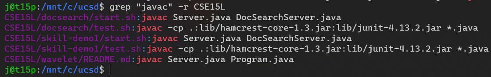

## Week 5 Lab Report

#### Chosen command: `grep`

### Option 1: `-r` / `--recursive`
This option is the most useful in my opinion because it makes `grep` recursively search all files in a directory. This means that you don't have to write a wildcard pattern such as `technical/*/*.txt` and can search through complex directory structures without worrying about missing any files or writing wildcards for every possible level.

#### Example 1a: Easily searching all documents in `technical`

*With the `-r` option, there's no need to write a pattern such as `technical/*/*`; `grep` will take care of searching the entire directory and sub-directories for you*

`grep "recursive" -r technical`:

#### Example 1b: Search nested files from different levels in `some-files`

*Notice that the files listed below are from different levels in the filesystem, making it impossible to search with a single wildcard*

`grep "e" -r some-files`:

#### Example 1c: Example use case, searching for all uses of `javac` in multiple repositories

*This could be a useful command to run for identifying files using `javac` if you wanted to, for example, change the classpath argument to use a semicolon instead of colon as a separator.*

`grep "javac" -r CSE15L`:

### Option 2: `-i` / `--ignore-case`

#### Example 2a: Search for a keyword that may appear at the beginning of a sentence

*With the `-i` option, `grep` includes matches for "indeed" at the start of a sentence (leading capital), and within a sentence (all lowercase).*

`grep "indeed" -i technical/plos/pmed.*`:

#### Example 2b: Search for text across title (all uppercase) and body sections

*In this case, `grep` searches for the text "evolve" in both body text and in the all-caps title header "COUNTERTERRORISM EVOLVES" in `technical\911report\chapter-3.txt`*

`grep "evolve" -i technical/911report/*.*`:

#### Example 2c: Combine with `-r`

*Combined with `-r`, `grep` is able to search for the keyword throughout all cases **a  nd** through all levels of the subdirectory structure*

`grep "importantly" -i -r technical/plos`:

### Option 3: `-c` / `--count`

#### Example 3a: Count the number of times a word appears

*With the -c option `grep` shows the number of occurrences instead of printing the matches. This can be useful for determining how often a word is used in a file, for example.*

`grep "evolve" technical/911report/*.* -c`:

#### Example 3b: Count the number of code statements in a file

*By using -c with a semicolon as the search pattern, `grep` is able to show the number of semicolons in the file, which corresponds with the number of code statements in each `.java` file (useful for excluding code blocks, comments, etc. from line counts, while also including multi-statement lines.)*

`grep ";" *.java -c`:

#### Example 3c: Combining all 3 options

*All 3 options can be combined, showing results in all subdirectories of `technical/911report`, counting case-insensitive matches for "evolve"*

`grep "evolve" -c -i -r technical/911report`:
